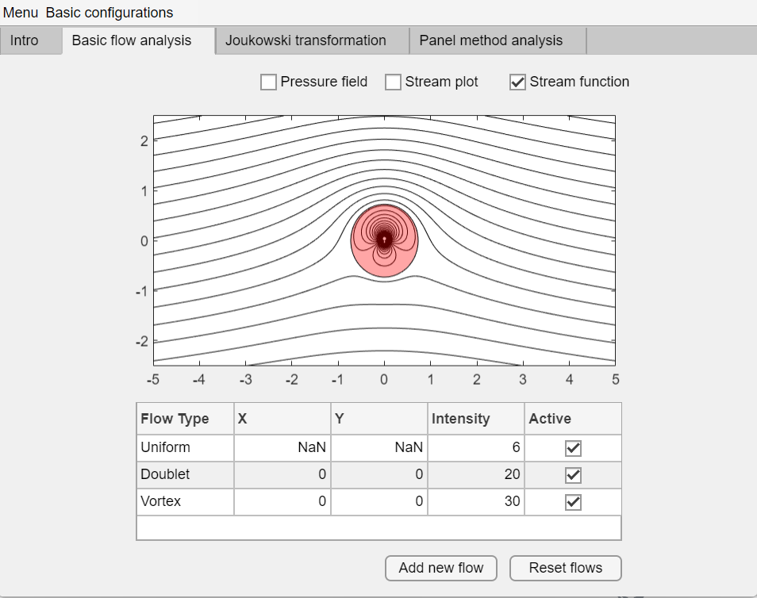
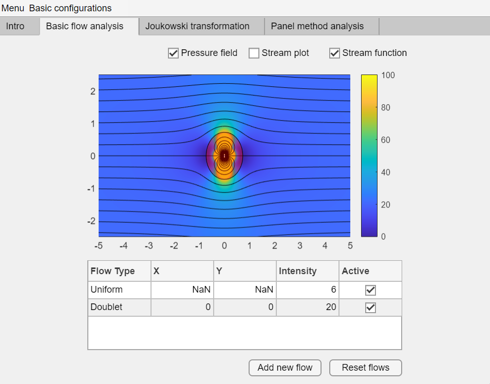
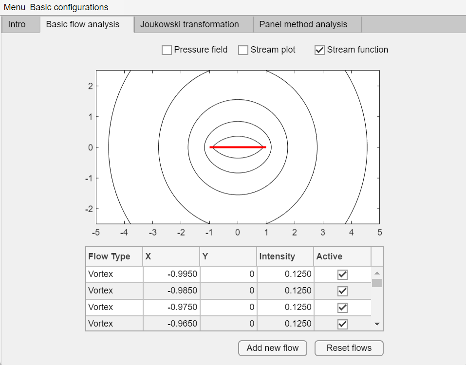
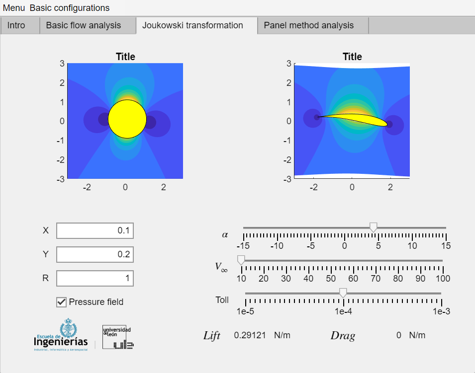
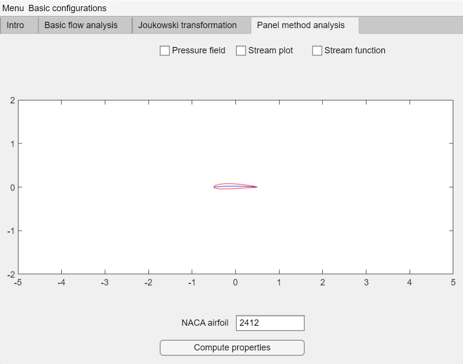

# Aero-app
Aerodynamics tool for basic flow analysis
- Elementary flow configurations
- Jukowski transformation
- (Currently developing) Panel method calculations on NACA airfoils

# Lifting cylinder stream lines

# Non-lifting cylinder pressure field

# Row of vortex

# Jukowski transformation implementation

# Panel method in NACA airfoils (developing)

